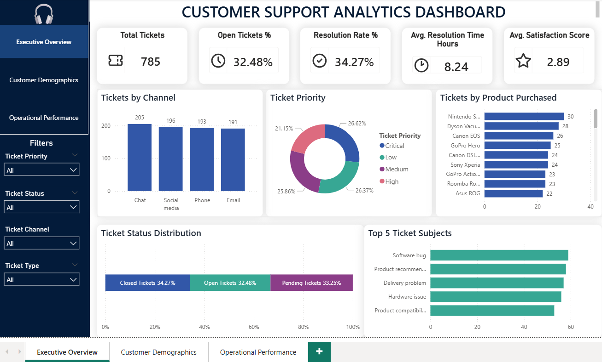

# 📊 Customer Support Ticket Analysis


## 📌 Project Overview

This project analyzes customer support ticket data using SQL and Power BI to uncover operational trends, customer satisfaction patterns, and ticket resolution performance.

The goal of this project is to demonstrate:

• SQL data cleaning and transformation

• Data quality validation

• KPI analysis and metric design

• Customer segmentation

• Dashboard development in Power BI

• End-to-end analytics workflow


## 🔎 Key Insights

• Identified differences in ticket resolution times across priority levels

• Found variation in customer satisfaction based on support channel

• Highlighted customer age groups with lower satisfaction scores

• Observed higher backlog rates in specific ticket channels

• Detected inconsistencies in ticket status reporting that required cleaning


## 🛠️ Tools Used

• SQL (SQLite)

• Power BI

• DBeaver (SQL development environment)

• Git & GitHub


## 📂 Dataset

The dataset contains customer support ticket records, including:

• Customer demographics (age, segment)

• Ticket priority and status

• Support channels (email, chat, phone, etc.)

• Resolution timestamps

• Customer satisfaction ratings

Dataset used is a sample/Kaggle dataset for learning and portfolio purposes.


## 🧹 Data Cleaning Process

A SQL view ```(clean_customer_tickets)``` was created to ensure data quality and consistency.

Cleaning steps:

• Remove invalid or incomplete records

• Validate customer age values

• Standardize ticket status values

• Check email format validity

• Create customer age groups for segmentation

**Example SQL:**

```sql
CASE
    WHEN "Customer Age" < 15 THEN '0-14'
    WHEN "Customer Age" BETWEEN 15 AND 25 THEN '15-25'
    WHEN "Customer Age" BETWEEN 26 AND 35 THEN '26-35'
    WHEN "Customer Age" BETWEEN 36 AND 50 THEN '36-50'
    ELSE '51+'
END AS age_group;

```


## 📁 Project Structure

```
├── data/

├── sql/

├── powerbi/

├── screenshots/

└── README.md

```


## 🚀 How to Run This Project

**1. Clone repository**

```
git clone https://github.com/GiselleAnido/customer-support-analysis.git
cd customer-support-analysis
```


**2. SQL setup**

• Open ```/sql``` folder

• Run scripts in SQLite or DBeaver

• Create and query ```clean_customer_tickets``` view


**3. Power BI dashboard**

• Open ```Ticket Support Analysis.pbix``` file in /```powerbi```

• Refresh data source if needed

• Explore dashboard visuals


## 📸 Dashboard Preview


Add screenshots in the ```/screenshots``` folder and display them like this:

```

```


## 💡 Skills Demonstrated


• SQL data cleaning and transformation

• Data validation and quality control

• KPI development

• Customer segmentation

• Power BI dashboard design

• End-to-end analytics workflow

• Git & GitHub version control


## 🔮 Future Improvements


• Build Python-based ETL pipeline

• Move data to PostgreSQL / cloud warehouse

• Add automated dashboard refresh

• Expand into predictive analytics (ticket resolution time)

• Add anomaly detection for ticket spikes


